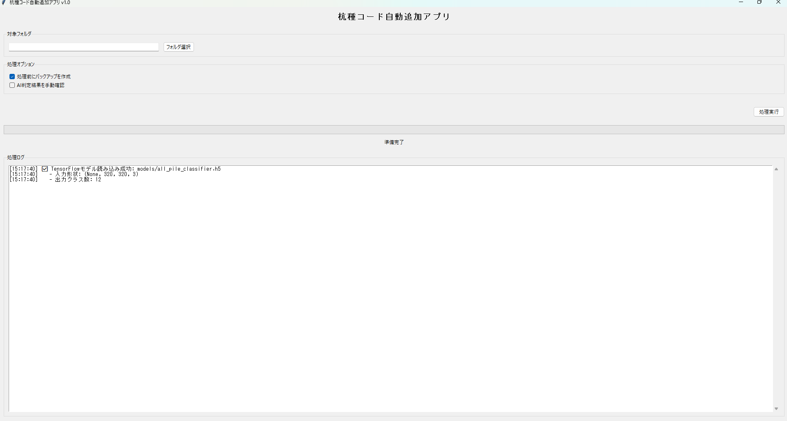
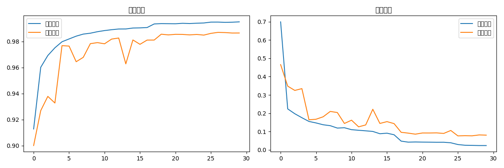
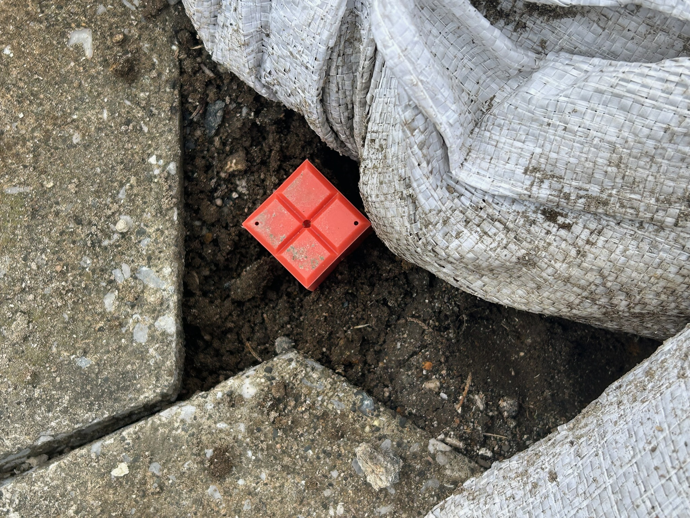
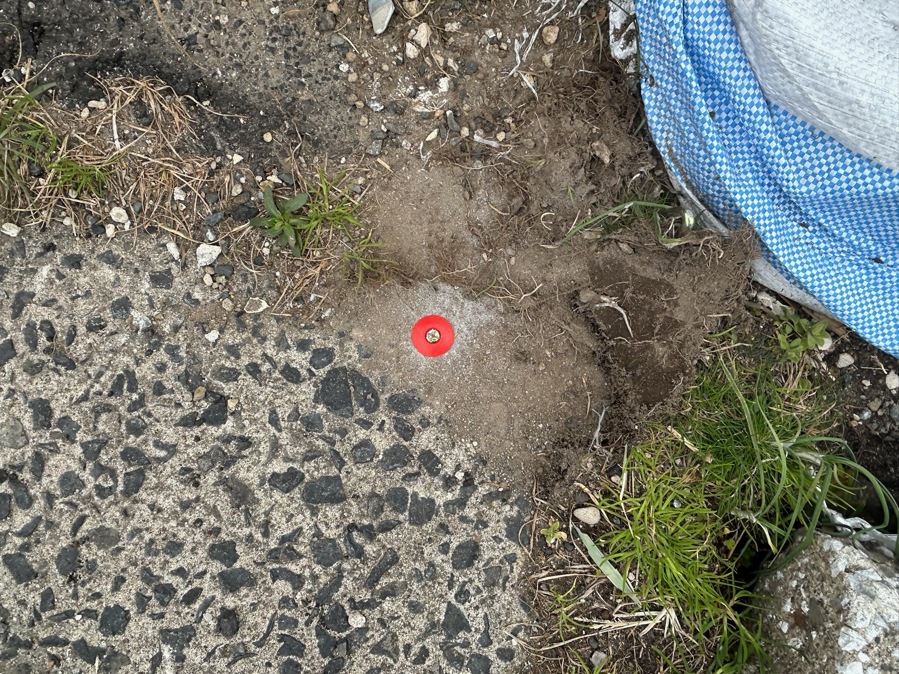
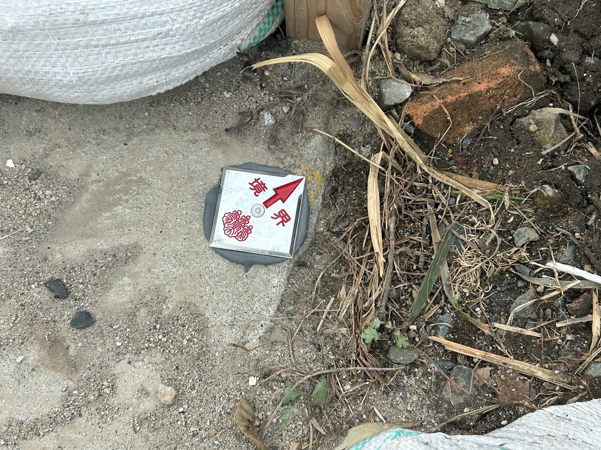

# 🤖 AI画像認識システム - 測量杭種の自動分類

[](https://www.python.org/downloads/)
[](https://www.tensorflow.org/)
[]()

**深層学習により、測量写真の分類作業を完全自動化し、1件あたり数時間の作業を数分に短縮**


---

## 🎯 解決した課題

測量業務において、報告書作成時に以下の作業が発生していました：

### 従来の手作業（1件あたり数時間）
1. **写真内容の目視確認** - 遠景か近景かを1枚ずつ判別
2. **杭種の識別** - プラスチック杭、金属鋲、コンクリート杭などを判別
3. **ファイル名への手動追加** - 杭種コード（P, B, C等）を手動入力
4. **報告書への配置** - 分類結果に基づいて写真を配置

**問題点**: 年間40〜80件の業務で、この判別作業に膨大な時間を消費

---

## ✅ 開発した解決策

**深層学習モデル（EfficientNetB0）**により、測量写真を12クラスに自動分類するAIシステムを開発。

### 主な機能

| 機能 | 説明 |
|------|------|
| **🧠 高精度AI分類** | 98.3%の精度で杭種を自動判定 |
| **⚡ 高速処理** | 100枚の写真を約10秒で分類 |
| **📱 GUIアプリ** | ドラッグ&ドロップで簡単操作 |
| **🏷️ 自動リネーム** | 杭種コードをファイル名に自動追加 |
| **🔄 バッチ処理** | フォルダ単位での一括処理対応 |

---

## 📊 成果

| 項目 | 改善効果 |
|------|---------|
| **分類精度** | **98.3%** （従来の目視: 85-90%） |
| **処理時間** | 数時間 → **数分** |
| **作業効率** | 約**95%の時間削減** |
| **エラー率** | 人的ミスを大幅削減 |
| **適用件数** | 年間40〜80件の業務に適用 |

### 処理例
```
処理前:
📁 survey_photos/
  ├── IMG_001-2.jpg
  ├── IMG_001-1.jpg
  ├── IMG_002-2.jpg
  └── IMG_002-3.jpg

↓ AI判定（約10秒）

処理後:
📁 survey_photos/
  ├── P_IMG_001-2.jpg   ← プラスチック杭（P）
  ├── P_IMG_001-1.jpg   ← 同じ点番はすべてP
  ├── B_IMG_002-2.jpg   ← 金属鋲（B）
  └── B_IMG_002-3.jpg   ← 同じ点番はすべてB
```

---

## 💡 開発プロセス

### 1. 実務経験からの課題抽出
- 8年間の測量業務で実際に直面した課題を分析
- 「どの杭種の判別が難しいか」「どこで間違えやすいか」を特定

### 2. 大規模データセットの作成
- **192,000枚**の画像データセット作成（12クラス × 各16,000枚）
- 実務で使用した過去8年分の測量写真を活用
- データ拡張（回転、反転、明度調整）で汎化性能を向上

### 3. 生成AI（Claude/ChatGPT）の活用
- モデル構築コードを生成AIで効率的に作成
- データ前処理パイプラインの実装を支援
- TensorFlow/Kerasの実装を学習

### 4. コードレビューと学習
- 生成されたコードを読解し、仕組みを理解
- ハイパーパラメータのチューニング
- 過学習の防止技術（Dropout, Early Stopping）を実装

### 5. 技術書による理論補完
- オライリー「Pythonではじめる機械学習」で理論学習
- オライリー「ゼロから作るDeep Learning」でCNNの基礎を習得

**現在も学習中**: モデルの仕組みを深く理解するため、継続的に技術書で学習しています。

---

## 🛠️ 技術スタック

```python
# AIモデル
TensorFlow 2.x / Keras
├── ベースモデル: EfficientNetB0 (ImageNet事前訓練)
├── パラメータ数: 1,547,580個
├── 最適化器: Adam
└── 正則化: Dropout(0.2) + Early Stopping

# データ処理
Python 3.8+
├── 画像処理: PIL, OpenCV
├── 数値計算: NumPy, pandas
└── 可視化: Matplotlib
```

---

## 🎨 システム画面・結果

### AIアプリケーション画面


### 学習曲線



### 分類結果例
| 入力画像 | AI判定 | 信頼度 |
|----------|--------|--------|
|  | プラスチック杭 (P) | 100.00% |
|  | 金属鋲 (B) | 100.00% |
|  | 金属プレート (PL) | 100.00% |


---

## 🧠 モデル詳細

### 対応する12クラス

| クラス名 | コード | 分類精度 |
|----------|--------|---------|
| プラスチック杭 | P | 98.5% |
| プレート | PL | 97.8% |
| 金属鋲 | B | 99.1% |
| コンクリート杭 | C | 98.7% |
| 引照点 | T | 99.3% |
| 国土基準点 | KD | 98.9% |
| 都市再生街区基準点 | GK | 97.6% |
| 都市再生街区節点 | GS | 98.2% |
| 都市再生街区多角点 | GT | 98.4% |
| 都市再生街区補助点 | GH | 97.9% |
| 引照点・他 | TI | 98.6% |
| 鹿児島登記引照点 | KI | 98.1% |

**平均分類精度: 98.3%**

### アーキテクチャ

```python
model = Sequential([
    # 事前訓練済みEfficientNetB0
    EfficientNetB0(include_top=False, input_shape=(224, 224, 3)),
    
    # カスタム分類層
    GlobalAveragePooling2D(),
    Dense(128, activation='relu'),
    Dropout(0.2),
    Dense(12, activation='softmax')
])
```

### 技術的な工夫

#### 1. データセット作成
- **192,000枚**の大規模データセット
- クラス間バランスの自動調整
- データ拡張による汎化性能向上

#### 2. 過学習の防止
- Early Stopping（patience=5）
- Dropout（0.2）
- L2正則化

#### 3. メモリ最適化
- バッチサイズ256での効率的処理
- PILベース画像読み込み（日本語パス対応）
- プログレッシブローディング

---

## 🚀 クイックスタート

### インストール
```bash
git clone https://github.com/D1424-da/AI.git
cd AI
pip install -r requirements.txt
```

### GUIアプリの起動
```bash
python pile_classifier_app.py
```

### 使い方
1. 「フォルダ選択」で処理したい写真フォルダを選択
2. 「処理実行」をクリック
3. AI判定結果を確認
4. ワンクリックで一括リネーム

---

## 📈 性能指標

### 処理速度
- **推論速度**: 89ms/画像（CPU）、12ms/画像（GPU）
- **100枚処理**: 約10秒（バッチ処理）

### リソース効率
- **メモリ使用量**: 4GB RAM（バッチサイズ256）
- **モデルサイズ**: 約150MB

---

## 🎯 今後の改善案

- [ ] より深いネットワーク（ResNet、Vision Transformer）の検証
- [ ] 転移学習の活用によるさらなる精度向上
- [ ] リアルタイム推論の高速化
- [ ] スマートフォンアプリ化（現場での即時判定）

---

## 📝 学習プロセス

このプロジェクトを通じて学んだこと：
- **CNNの理論と実装**: 畳み込み層、プーリング層の役割理解
- **大規模データ処理**: メモリ効率的なデータローディング
- **過学習の防止技術**: Dropout、Early Stoppingの実装
- **実務課題への技術適用**: 業務知識とAIの融合
- **生成AIの効果的な活用**: 要件定義と学習の重要性

---

## ⚠️ 注意事項

- このAIシステムは98.3%の高精度ですが、**重要な測量作業では必ず結果を目視確認**してください
- 大量処理時は事前にバックアップを作成することを推奨します

---

## 📄 ライセンス

MIT License

## 👤 作者

**池田大介 (Daisuke Ikeda)**
- GitHub: [@D1424-da](https://github.com/D1424-da)
- Email: d.i.a.0101@gmail.com

---

**🤖 深層学習で測量業務を革新し、本質的な業務に集中できる時間を創出します**